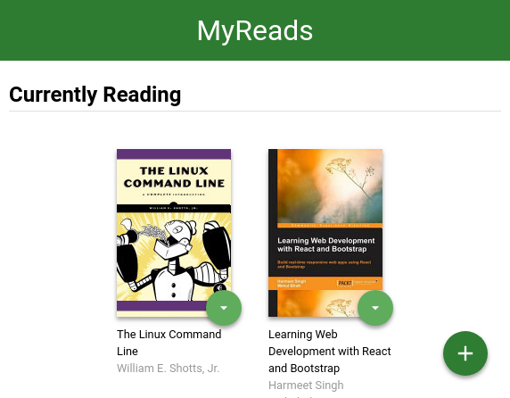

# MyReads Project

MyReads project is a requirement to graduate from Udacity frontend nanodegree. Project bootstrap (html and css) were provided by Udacity at this repository https://github.com/udacity/reactnd-project-myreads-starter.

This project is a book categorizing app where books are divided between three shelves, "currently reading", "want to read" and "read" shelves. The user can change a book's shelf or totally remove it using the dropdown menu in a book's card. The user also can search books to add them to his/her shelves.

Books and user data are stored on Udacity server at "https://reactnd-books-api.udacity.com". When the user first uses the app, he/she is created an authorization token stored on his/her local storage, This token is then used to identify the user when making requests to the server. The app handles received data and network appropriately. When a data piece is missing, it's set to a default value. And when network goes down, a network error message appears.

The app is built off React front end library and bootstrapped using create-react-app. you can check the app components architecture [below](#components-architecture)

There's a static version of the app living over [gh-pages](https://github.com/i-mw/react-myreads/tree/gh-pages) branch in this repository. This version is deployed to github pages and you can view it at https://i-mw.github.io/react-myreads/. To run your own static version, check [below](#produce-static-version)



## Table of Contents

* [Quick Start](#quick-start)
* [Installation Guides](#installation-guides)
* [Direct Dependencies](#direct-dependencies)
* [Files Structure](#files-structure)
* [Components Architecture](#components-architecture)
* [Backend Server](#backend-server)
* [Search Terms](#search-terms)
* [Create React App](#create-react-app)
* [Contributing](#contributing)

## Quick Start

To get started developing right away:

* install all project dependencies with `npm install`
* start the development server with `npm start`

# Installation Guides

## Run Local Development Server

To run local development server you need the following tools:
* git
* node
* npm

After installing the previous tools, run these commands:

* `git clone https://github.comv/i-mw/react-myreads.git` => to download the repository
* `cd react-myreads` => to move to project directory
* `npm install` => to install all project dependencies
* `npm run` => to run local development server

## Produce Static Version

Before executing production command, you need to change the value of `homepage` in `package.json` file to the intended url of the project. Its set by default to `"https://i-mw.github.io/react-myreads"`. If you intend to run it locally, just leave it.

Then, you can produce a static version by running: `npm run build` after that static version will be available at `react-myreads/build`

The project is customized to view the static version correctly wherever you deploy it

N.B.: There's a static version of the app living over [gh-pages](https://github.com/i-mw/react-myreads/tree/gh-pages) branch in this repository. This version is deployed to github pages and you can view it at https://i-mw.github.io/react-myreads/

## View/Deploy Static Version

To view or deploy the produced static version, you have 3 options: 

* ### View locally
    To view your static version locally, you need a static server. You can't run it using `index.html` file, that's because local files don't have hostname and its a requirement for the project to run.

    run:
    
    `npm install -g serve` => to install static server

    `serve -s build` => to run static server

* ### Deploy to github pages
    To publish on a standalone repository for the static version, do the following:
    * create github repository
    * change `homepage` value in `package.json` to github pages url of your repository
    * build the static version as mentioned above
    * isolate build folder out of the project repository and create independent local repository for it
    * push your new repository to github repository `git push origin master`
    * from settings, publish your website using `master` branch

    To publish using the repository of the same project, use `gh-pages` interface:
    * `npm install gh-pages --save-dev` => to install gh-pages
    * change `homepage` value in `package.json` to github pages url of your repository
    * `git remote add origin <remote repo>` to link your github repository
    * npm run deploy => to build and publish your static version

    N.b. on deploying to github pages, you need to add custom `404.html` page next to and contain the same content of `index.html` to handle routeing of the app.

* ### Deploy to custom server
    To do so, you need to:
    * change `homepage` value in `package.json` to intended project url
    * build the static version as mentioned above
    * upload `build` folder to your server
    * handle 404 and routeing

## Direct Dependencies

The project has these direct code dependencies, as indicated in `package.json` file:
* react
* react-dom
* react-router
* propTypes

And one Development dependency:
* react-scripts

## Files Structure

```bash
├── CONTRIBUTING.md
├── README.md - This file.
├── SEARCH_TERMS.md # The whitelisted short collection of available search terms.
├── package.json # npm package manager file.
├── public
│   ├── favicon.ico # React Icon, You may change if you wish.
│   ├── loading.gif # Loading Icon
│   ├── placeholder.jpg # Placeholder image for books
│   └── index.html # DO NOT MODIFY
└── src
    ├── App.css # Styles for the app.
    ├── App.js # This is the root of the app.
    ├── App.test.js # Used for testing. Provided with Create React App.
    ├── BooksAPI.js # A JavaScript API for the provided Udacity backend.
    ├── icons # Helpful images for app.
    │   ├── add.svg
    │   ├── arrow-back.svg
    │   └── arrow-drop-down.svg
    ├── index.css # Global styles.
    ├── ListBook.js # React component
    ├── Shelf.js # React component
    ├── Book.js # React component
    ├── Search.js # React component
    ├── SearchInput.js # React component
    ├── SearchResults.js # React component
    ├── NotFound.js # React component
    └── index.js # This file is used for DOM rendering only.
```

## Components Architecture

```bash
App
├── ListBooks # Main page
│   └── Shelf # Book shelves
│       └── Book # Book card
├── Search # Search page
│   ├── SearchInput # Search input
│   └── SearchResults # Search results
│       └── Book # Book card
└── NotFound # Not found page
```

## Backend Server

To simplify development process, Udacity has provided a backend server to develop against. The provided file [`BooksAPI.js`](src/BooksAPI.js) contains the methods needed to perform necessary operations on the backend:

* [`getAll`](#getall)
* [`update`](#update)
* [`search`](#search)

#### `getAll`

Method Signature:

```js
getAll()
```

* Returns a Promise which resolves to a JSON object containing a collection of book objects.
* This collection represents the books currently in the bookshelves in your app.

#### `update`

Method Signature:

```js
update(book, shelf)
```

* book: `<Object>` containing at minimum an `id` attribute
* shelf: `<String>` contains one of ["wantToRead", "currentlyReading", "read"]  
* Returns a Promise which resolves to a JSON object containing the response data of the POST request

#### `search`

Method Signature:

```js
search(query)
```

* query: `<String>`
* Returns a Promise which resolves to a JSON object containing a collection of a maximum of 20 book objects.
* These books do not know which shelf they are on. They are raw results only. You'll need to make sure that books have the correct state while on the search page.

## Search Terms
The backend API uses a fixed set of cached search results and is limited to a particular set of search terms, which can be found in [SEARCH_TERMS.md](SEARCH_TERMS.md). That list of terms are the _only_ terms that will work with the backend.

## Create React App

This project was bootstrapped with [Create React App](https://github.com/facebookincubator/create-react-app). You can find more information [here](https://github.com/facebookincubator/create-react-app/blob/master/packages/react-scripts/template/README.md).

## Contributing

As this project is part of a program and meant only for personal improvement, Its not open for contribution. But you can refer to a feature or a bug in Issues section.

For details, check out [CONTRIBUTING.md](CONTRIBUTING.md).
